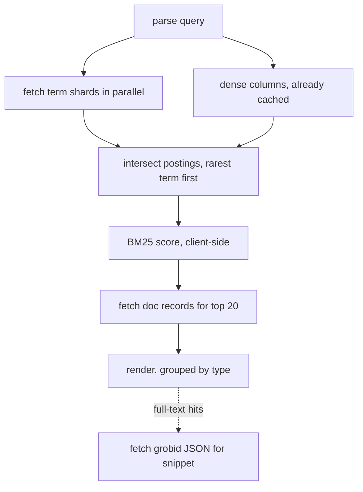

# Plan: custom search for the Anthology

**Status:** Proposed; no implementation yet
**Date:** 2026-08-21
**Related code:** [`hugo/assets/js/author-search.js`](../hugo/assets/js/author-search.js),
[`bin/benchmark_search.py`](../bin/benchmark_search.py),
[`bin/create_hugo_data.py`](../bin/create_hugo_data.py),
[full-text extraction](fulltext-extraction.md)

## Motivation

Site-wide search is currently Google Custom Search: an external dependency whose
result quality we do not control and cannot tune, over an index we cannot
inspect. Meanwhile two things have changed.

1. The author index proved the model. `author-search.js` fetches one small
   bucket on demand and searches it in the browser, and it is *fast* — fast
   enough that it beats going to Google for the case it covers.
2. [GROBID extraction](fulltext-extraction.md) now produces the paper body for
   every PDF, so full text is available as data rather than as something only a
   crawler can see.

The gap is everything in between: titles, abstracts, venues, and body text, with
no way to say which field you meant.

## Goal

- Fast search over our entire holdings, including PDF body text
- Minimal setup and configuration for mirrors; ideally, a static index that can be rsynced alongside the site.
- Field-based query language supporting year ranges, title/abstract/body, authors, and body text

Example query:
```text
translation title:findings author:"chris callison-burch" year:<2010
```

and a results page that groups hits by type the way the dropdown labels them.

## Thoughts on a static approach

The corpus is not overly large:

| | |
| --- | --- |
| Documents | 127,732 |
| Vocabulary (title + abstract) | 117,082 |
| Postings (term–doc pairs) | 8,849,786 |
| Author–paper pairs | 486,858 |
| Terms occurring exactly once | 67,177 (57%) |

Delta-encoded varint postings run about 1.5–2 bytes each, so the whole
title+abstract inverted index is **15–20 MB** — and no client ever downloads all
of it. Sharded 256 ways, a shard is ~70 kB and a three-term query fetches three
of them. Body text is perhaps 30× larger in postings, which is a lot of bytes on
disk and still only ~100 kB per query, because payload scales with the *query's*
terms, not with the corpus.

The two properties that make this work are worth stating explicitly, because
they drive every decision below:

- **Per-query cost is proportional to the rarest query term**, not to corpus size.
- **Disk is free** on a static host; only bytes-over-the-wire matter.

## Query language

```text
translation                     bare terms search title, abstract, and body
title:findings                  restrict the next token to one field
author:"matt post"              quotes group a multi-word value
year:<2010  year:2010-2015      comparisons and ranges on numeric fields
venue:acl  event:acl-2025       exact-match categorical fields
-neural                         exclude
```

Terms combine with implicit AND. A repeated field ANDs
(`author:post author:callison-burch` means both). Supported fields: `title`,
`abstract`, `author`, `editor`, `venue`, `event`, `sig`, `year`, `type`, `doi`,
`bibkey`, `fulltext`.

Note the ambiguity in `author:matt post callison-burch`: without quotes that is
`author:matt` plus two bare terms. The parser should quietly treat consecutive
capitalized-ish tokens after `author:` as one name and *show the user how it
parsed the query*, with a click to correct it. Search syntax that silently
misreads you is worse than no syntax.

## Architecture

Four kinds of static artifact, each fetched only when needed:

| Artifact | Contents | Size | When fetched |
| --- | --- | --- | --- |
| **Dense columns** | year, venue, type, doc length, per paper | ~800 kB | once, cached |
| **Term shards** | postings, sharded by `hash(term) % N` | 15–20 MB total (metadata), ~1 GB (body) | per query term |
| **Author postings** | person → papers | ~1.5 MB total | per author term |
| **Doc records** | title, authors, year for display | ~40 MB total | only for shown results |

Separate term indexes per field (titles, abstracts, body) rather than one index
with field bitmasks: `title:findings` then fetches from a small file, and bare
terms union across all three with different weights. The titles index is tiny;
the duplication is worth the simplicity.

Sharding by `hash(term) % N` means **no term dictionary has to be shipped** — the
client computes the shard directly. Shard paths carry the build hash so they can
be cached forever.

### Executing a query



Two details that matter:

- **Filters are not inverted.** `year:<2010` is a scan over a typed array of
  127k `uint16`s — under a millisecond, and it handles ranges, which inverted
  indexes are bad at. Same for venue and type.
- **Snippets are not stored.** For the handful of body hits actually displayed,
  fetch that paper's `grobid/….json`, which is already served, and cut the
  snippet client-side. The index stays free of text.

### Ranking

BM25 in the browser. It needs document frequency, which is the posting list
length we just fetched, and document length, which lives in the dense columns.
Weights per field (title ≫ abstract > body) are constants we tune by hand
against real queries. Nothing about this needs a server.

### Building and deploying

The build reads the XML and the GROBID tree, so it runs **on the server** after
the extraction cron, not in CI — the full text does not exist anywhere else. It
emits a directory of static files that rsync alongside the site. Rebuild is
per-collection incremental, keyed on the same `extraction_version` the
extractions carry.

## Phases

0. **Evaluate Pagefind first.** It is the buy-versus-build option: static,
   sharded, with prebuilt UI. The likely blocker is that its filters are
   facets, which do not express `year:<2010` or fuzzy author matching. Spend a
   day indexing one year and find out — if it fits, most of this plan is moot.
1. **Index builder + CLI.** Emit the artifacts above; query them from a Python
   CLI. This measures real shard sizes and settles ranking quality with zero UI
   work.
2. **Query parser**, shared between the CLI and the browser as the same grammar,
   with tests over the tricky cases (quoting, ranges, negation, the `author:`
   ambiguity).
3. **Browser client** in a web worker: fetch, intersect, score. Wire it to the
   existing dropdown, which keeps showing instant author hits from the current
   index while paper hits arrive.
4. **Results page** with tabs by type. Keep Google CSE as a fallback tab until
   we trust our own results.

## Deferred

- **Lemmas and morphology.** Tempting for NLP, and light Snowball stemming would
  merge `parsing`/`parser`/`parse` at essentially no cost. But stemming loses
  exact-match precision, and full lemmatization or POS is far more machinery
  than the win justifies. If we do it: index stems *in addition to* exact terms
  in the titles index only, where the index is small enough not to care.
- **Phrase queries.** Need positional postings, which multiply index size several
  times over. Plausible for titles alone; not for body text in v1.
- **Semantic / hybrid retrieval.** BM25 has no idea that "MT" and "machine
  translation" are the same thing. An embedding index is a real project and a
  much bigger one; a hand-curated synonym list for a few dozen NLP acronyms
  would capture a surprising share of the benefit first.

## Open questions

- Do we index the body of *every* paper, or only where GROBID succeeded? Roughly
  1% of old scans return no text at all, and coverage is uneven before ~2010.
  Results must not silently imply those papers do not match.
- References are extracted too. Do citation strings become a searchable field
  ("who cites Brown et al.?"), or noise?
- How much of the corpus should the dropdown search? Body hits are the slowest
  to arrive and the least likely to be what a navbar user wants.
- Mirrors: the index is static and rsyncs cleanly, but it is large. Do mirrors
  take it, or fall back to metadata-only search?

## References

- Pagefind, the closest off-the-shelf equivalent: <https://pagefind.app>
- BM25: Robertson & Zaragoza, *The Probabilistic Relevance Framework*, 2009
- The existing author search, which is a working proof of the fetch-a-shard
  model: [`hugo/assets/js/author-search.js`](../hugo/assets/js/author-search.js)
