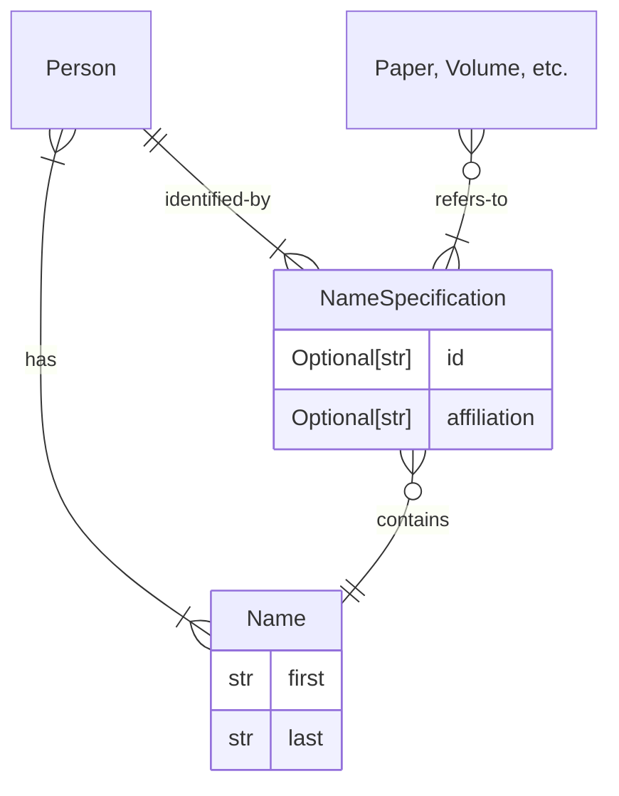

# Accessing Authors/Editors

People are complicated.[^1]  Metadata for publications often only includes the
"name" of each author given as a string; but names can be ambiguous (the same
name can refer to different people), and conversely, the same person can have
published under different names.

[^1]: Both in real life and in bibliographic metadata.

Therefore, when it comes to names and personal identities, this library
distinguishes between the following three concepts:

- [`Name`][acl_anthology.people.name.Name] objects represent a name. They are
  essentially strings with a little bit of metadata, but contain no information
  about the actual _identity_ of a person behind the name.
- [`NameSpecification`][acl_anthology.people.name.NameSpecification] objects
  represent authors/editors as specified on a publication. They are essentially
  names with optional extra information for disambiguation, such as the person's
  affiliation or their internal Anthology ID.
- [`Person`][acl_anthology.people.person.Person] objects represent natural
  persons.  They may have one or more names, but will always have one name that
  we consider to be the "canonical" one.

!!! tip

    It is useful to remember that only a **Person** can have publications.  If you have only a **Name** or a **NameSpecification**, you first need to _resolve_ that to a Person before you can look up papers authored/edited by that person.

## Names

A person's name is always split up into **first** and **last** name components.
While this, of course, doesn't fully reflect the complexities of how names work
across different cultures, it is the minimum structure that we assume in order
to, e.g., generate accurate bibliographic information.

The following ways to instantiate a Name are equivalent:

```python
from acl_anthology.people import Name
Name("Yang", "Liu")
Name(last="Liu", first="Yang")
```

If a person only has a single name, the convention is to record this as the
**last** name.  In this case, the first name part must be explicitly given as
`None`:

```python
Name(None, "Mausam")
```

### Looking up names

To look up names, use
[`anthology.find_people`][acl_anthology.anthology.Anthology.find_people], which
will return a list of persons that can be referred to by that name:

```pycon
>>> anthology.find_people(Name("Yang", "Liu"))
[
    Person(id='yang-liu-edinburgh', names=[Name(first='Yang', last='Liu')], item_ids=<set of 15 AnthologyIDTuple objects>, comment='Edinburgh'),
    Person(id='yang-liu-blcu', names=[Name(first='Yang', last='Liu')], item_ids=<set of 1 AnthologyIDTuple objects>, comment='Beijing Language and Culture University'),
    Person(id='yang-liu-hk', names=[Name(first='Yang', last='Liu')], item_ids=<set of 3 AnthologyIDTuple objects>, comment='The Chinese University of Hong Kong (Shenzhen)'),
    ... 12 more ...
]
```

For convenience, you can also call `.find_people()` with tuples or strings; the
following are all equivalent:

```python
anthology.find_people("Yang Liu")
anthology.find_people("Liu, Yang")
anthology.find_people(("Yang", "Liu"))
```

However, supplying a `{first} {last}` string only works as long as the split is
unambiguous; you must use the `{last}, {first}` format otherwise:

```python
anthology.find_people("Daniel A. McFarland")      # raises ValueError
anthology.find_people("McFarland, Daniel A.")     # works
```

## Name specifications

Author or editor fields, e.g. on papers, will always return a
[`NameSpecification`][acl_anthology.people.name.NameSpecification].  This is
mostly a regular name with an optional ID (i.e., the name was already manually
disambiguated by us) and affiliation.  In the example below, you can see that
author "Yang Liu" was assigned an explicit ID in the metadata:

```pycon
>>> paper = anthology.get("2021.emnlp-main.151")
>>> paper.authors
[
    NameSpecification(name=Name(first='Jialu', last='Wang'), id=None, affiliation=None, variants=[]),
    NameSpecification(name=Name(first='Yang', last='Liu'), id='yang-liu-umich', affiliation=None, variants=[]),
    NameSpecification(name=Name(first='Xin', last='Wang'), id=None, affiliation=None, variants=[])
]
```

The "variant" field is not systematically used at the moment, but is intended
for name variants _written in a different script_, such as:

```pycon
>>> anthology.get("2021.ccl-1.1").authors
[
    NameSpecification(name=Name(first='Hao', last='Wang'), id=None, affiliation=None,
                      variants=[Name(first='浩', last='汪')]),
    NameSpecification(name=Name(first='Junhui', last='Li'), id=None, affiliation=None,
                      variants=[Name(first='军辉', last='李')]),
    NameSpecification(name=Name(first='Zhengxian', last='Gong'), id=None, affiliation=None,
                      variants=[Name(first='正仙', last='贡')])
]
```

### Looking up name specifications

In contrast to names, name specifications will _always_ resolve to a _single_
person.  This is enforced by our metadata checks; if name specifications are
ambiguous, they _must_ be resolved before the data can appear in the ACL
Anthology.

To look up name specifications, use
[`anthology.resolve`][acl_anthology.anthology.Anthology.resolve], which will
return the person that is being referred to:

```pycon
>>> paper = anthology.get("2021.emnlp-main.151")
>>> name_spec = paper.authors[1]
>>> name_spec
NameSpecification(name=Name(first='Yang', last='Liu'), id='yang-liu-umich', affiliation=None, variants=[])
>>> anthology.resolve(name_spec)
Person(
    id='yang-liu-umich',
    names=[Name(first='Yang', last='Liu')],
    item_ids=<set of 4 AnthologyIDTuple objects>,
    comment='Univ. of Michigan, UC Santa Cruz'
)
```

## Persons

A [`Person`][acl_anthology.people.person.Person] object represents a natural
person.  The documentation above showed how persons can be looked up via names
or name specifications; they can also be retrieved directly from their ID:

```python
anthology.get_person("yang-liu-umich")
```

A person will always have exactly one **canonical name**, which is the one that
is used as the leading name on author pages:

```pycon
>>> person = anthology.get_person("dan-mcfarland")
>>> person.canonical_name
Name(first='Dan', last='McFarland')
```

They may also have additional names:

```pycon
>>> person.names
[
    Name(first='Dan', last='McFarland'),
    Name(first='Daniel', last='McFarland'),
    Name(first='Daniel A.', last='McFarland')
]
```

### Looking up publications

You can get a set of all items associated with a person:

```pycon
>>> person.item_ids
{('Q18', '1', '28'), ('2020.findings', 'emnlp', '158'), ('W11', '15', '16'), ...}
```

For convenience, you can also use
[`Person.volumes()`][acl_anthology.people.person.Person.volumes] and
[`Person.papers()`][acl_anthology.people.person.Person.papers] to iterate over
the set of volumes/papers that person is associated with.

## An Entity-Relationship diagram


