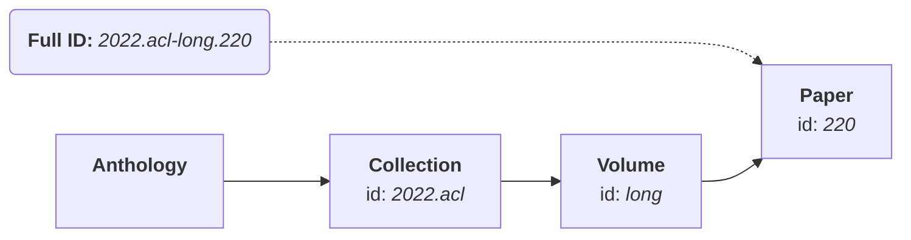

# Accessing Publications

## Data hierarchy

Publications in the ACL Anthology are organized into _collections_ of _volumes_
containing _papers_.  A _volume_ is a set of related papers that would
traditionally have been bound and published as a physical book.  A _collection_
is a group of volumes that were published at the same time under the same
_venue_.

For example, the [paper with the Anthology ID “2022.acl-long.220”](https://aclanthology.org/2022.acl-long.220/) belongs to the _collection_ `2022.acl` (indicating that it was published at ACL 2022), the _volume_ `long` (which subsumes all long papers at the conference), and has the paper ID `220`.  The following graph illustrates this hierarchy:



The library organizes data the same way.  You can use
[`anthology.get()`][acl_anthology.anthology.Anthology.get] to access
collections, volumes, or papers by their corresponding IDs.

```python
anthology.get("2022.acl")           # returns the Collection '2022.acl'
anthology.get("2022.acl-long")      # returns the Volume '2022.acl-long'
anthology.get("2022.acl-long.220")  # returns the Paper '2022.acl-long.220'
```

!!! warning

    All `.get` and `.get_*` functions will return `None` if the given ID doesn't correspond to any item in the Anthology data, so you probably want to check their return value.

### Manipulating Anthology IDs

As you can see above, Anthology IDs like `2022.acl-long.220` can be split into parts
representing the _collection_, _volume_, and _paper_.  You can use the utility
functions in [`utils.ids`](../api/utils.md#utilsids) to convert IDs between strings
and tuples:

```python
from acl_anthology.utils.ids import parse_id, build_id

parse_id("2022.acl-long.220")         # returns ('2022.acl', 'long', '220')
build_id("2022.acl", "long", "220")   # returns '2022.acl-long.220'
```

Functions that take Anthology IDs will usually accept both the string and the
tuple form, so the following also works:

```python
anthology.get(("2022.acl", "long", "220")) # returns the Paper '2022.acl-long.220'
```

To distinguish between their _local_ ID and their _full(y qualified)_ ID,
child objects provide separate attributes for these:

```python
paper = anthology.get("2022.acl-long.220")
paper.id                              # returns '220'
paper.full_id                         # returns '2022.acl-long.220'
paper.full_id_tuple                   # returns ('2022.acl', 'long', '220')
```

## Looking up publications

As we saw above, all collections, volumes, and papers can be accessed by calling
[`anthology.get()`][acl_anthology.anthology.Anthology.get] with their Anthology
ID.  If you know that you are looking for a specific type of item, you can also use:

- [`anthology.get_volume()`][acl_anthology.anthology.Anthology.get_volume] to only look up volumes
- [`anthology.get_paper()`][acl_anthology.anthology.Anthology.get_paper] to only look up papers

### Working with containers

You can also store and work with the child objects (representing
e.g. collections or volumes) directly.  Following the [data
hierarchy](#data-hierarchy) described above, child objects of the
[`Anthology`][acl_anthology.anthology.Anthology] class are also organized in a
hierarchical fashion:

- The [`CollectionIndex`][acl_anthology.collections.index.CollectionIndex] is a container mapping collection IDs to [`Collection`][acl_anthology.collections.collection.Collection] objects. _(The index is accessible as `anthology.collections`.)_
- [`Collection`][acl_anthology.collections.collection.Collection] objects are containers mapping volume IDs to [`Volume`][acl_anthology.collections.volume.Volume] objects.
- [`Volume`][acl_anthology.collections.volume.Volume] objects are containers mapping paper IDs to [`Paper`][acl_anthology.collections.paper.Paper] objects.

This means that the following are all equivalent:

```python
anthology.get("2022.acl-long.220")                # Paper '2022.acl-long.220'
anthology.get("2022.acl").get("long").get("220")  # same
anthology.collections["2022.acl"]["long"]["220"]  # same
```

!!! tip

    **The rule of thumb is that all containers provide dictionary-like functionality.**

This means that, among other things, the following all work as they would with a regular dictionary object:

```python
volume = anthology.get_volume("2022.acl-long")
volume.get("220")         # returns the Paper '2022.acl-long.220'
volume["220"]             # returns the Paper '2022.acl-long.220'
                          # ^... but raises KeyError on invalid IDs
"220" in volume           # returns True if paper ID '220' exists in this volume
len(volume)               # returns the number of papers in this volume
list(volume)              # returns a list of paper IDs in this volume
```

### Iterating over containers

Since containers behave like dictionaries, you can iterate over their contents
in the same way:

```python
volume = anthology.get_volume("2022.acl-long")
for paper_id, paper in volume.items():
    print(paper.full_id)
```

Note that this means iterating over the container directly will iterate over its
_keys_:

```python
for paper in volume:
    print(paper)          # will print paper IDs, not Paper objects!
```

To return a generator over the _values_, i.e. the actual child objects, you can
use these semantically named functions:

```python
collection = anthology.get("2022.acl")
for volume in collection.volumes():
    for paper in volume.papers():
        print(paper.full_id)
```

### Accessing parents

All child objects also keep pointers to their direct parent (`.parent`) as well
as the [`Anthology`][acl_anthology.anthology.Anthology] instance they belong to
(`.root`), so you can also easily navigate upwards in the hierarchy.

```python
paper = anthology.get("2022.acl-long.220")
paper.parent                        # returns the Volume '2022.acl-long'
paper.parent.parent                 # returns the Collection '2022.acl'
paper.parent.parent.parent          # returns the CollectionIndex
paper.parent.parent.parent.parent   # returns the Anthology
paper.root                          # returns the Anthology, but less confusingly
```

## Looking up events

Events can be accessed through
[`anthology.get_event()`][acl_anthology.anthology.Anthology.get_event] or via
`anthology.events`, which is the
[`EventIndex`][acl_anthology.collections.eventindex.EventIndex]. Event IDs are
typically of the form `{venue}-{year}`; e.g., "acl-2022" is the event ID for ACL
2022:

```python
event = anthology.get_event("acl-2022")
```

Papers and volumes can infer their associated events via
[`.get_events()`][acl_anthology.collections.volume.Volume.get_events]:

```python
[event.id for event in paper.get_events()]         # returns ['acl-2022']
```


## Loading the entire Anthology data

The Anthology metadata is distributed across many individual XML and YAML files
_(over 1,500 files as of October 2023)_, and loading all of this data can take a
bit of time and memory.  Fortunately, you normally don't need to worry about
that, as the Anthology library only loads files on-demand as they are required.
For example, if you access the paper with ID `2022.acl-long.220`, the library
will load the file `xml/2022.acl.xml` from the data directory, which (hopefully)
contains the metadata for the requested paper.

However, if you know that you will eventually process the entire Anthology data
anyway, it _can_ be faster to load the entire Anthology data at once:

```python
anthology.load_all()
```

!!! warning

    It is **_never required_** to call this function, and calling it **may**
    or **may not** provide a speed-up, depending on what kind of data you are
    accessing and in which manner.

When developing or modifying the Anthology data, this function can also be
useful to check that the library can read and process the entirety of the data
in the data directory without errors.
